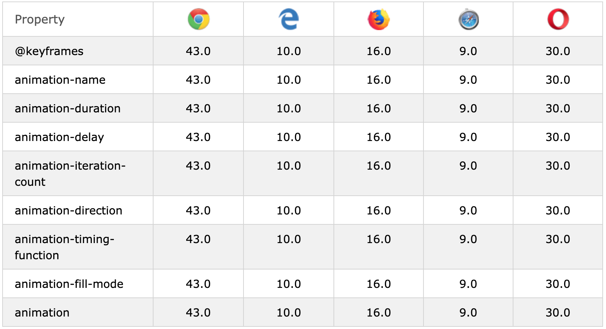

# Animation

## Browser Support

## Syntax
* animation-name
* animation-duration(s)
* animation-delay(s)
* animation-iteration-count: e.g. 3 or infinite
* animation-direction: normal, reverse, alternate, alternate-reverse
* animation-timing-function: ease, linear, ease-in, ease-out, ease-in-out, cubic-bezier(n,n,n,n)
* animation-fill-mode: none, forwards, backwards, both
* animation: animation-name, animation-duration, animation-timing-function, animation-delay, animation-iteration-count, animation-direction

## Reference
* https://www.w3schools.com/cssref/css3_pr_filter.asp
