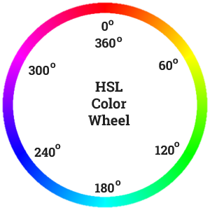

# Color

## Color Wheel

<p float="left">
	
</p>

```
$red: 	 hsl(355, 100%, 50%);
$orange: hsl(20, 100%, 50%);
$yellow: hsl(60, 100%, 50%);
$green:  hsl(120, 100%, 50%);
$cyan:   hsl(180, 100%, 50%);
$blue:   hsl(240, 100%, 50%);
$violet: hsl(300, 100%, 50%);
```

## Reference
* https://tallys.github.io/color-theory/

