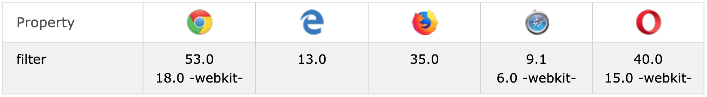

# Filter

## Browser Support

## Syntax

playground: https://www.w3schools.com/cssref/playit.asp?filename=playcss_filter

* none: default.
* blur(px): 0px is default.
* brightness(%): 0% is black,  100% is default, over 100% is brighter.
* contrast(%): 0% is black,  100% is default, over 100% is more contrast.
* drop-shadow(x: px, y: px, blur: px, spread: px, color: gray)
* grayscale(%): 0% is default, 100% is completely gray.
* hue-rotate(deg): max is 360deg.
* invert(%): 0% is default, 100% is completely inverted.
* opacity(%): 0% is completely transparent, 100% is default.
* saturate(%): 0% is completely un-saturated, 100% is default, over 100% is super-saturated.
* sepia(%): 0% is default, 100% is completely sepia.
* url(): url() function takes the location of an XML file that specifies an SVG filter, and may include an anchor to a specific filter element.

## References
* https://www.w3schools.com/cssref/css3_pr_filter.asp
