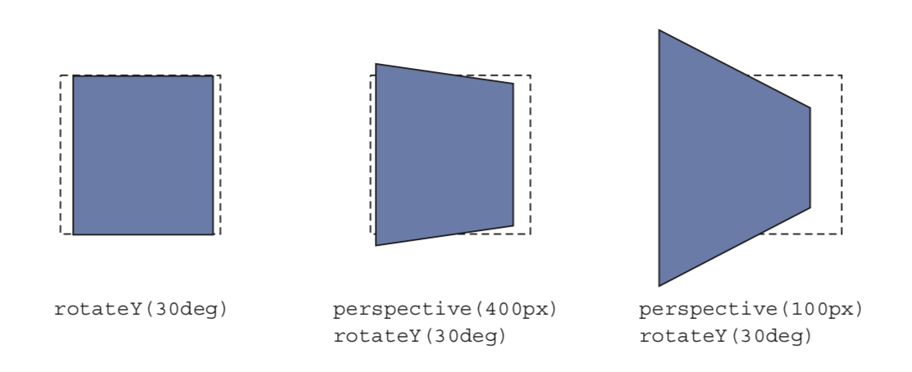

# Transform

## Syntax
* rotate(deg)
* rotateX(deg)
* rotateY(deg)
* rotateZ(deg)
* translate(x: px, y: px)
* translateX(x)
* translateY(y)
* translateZ(z)
* scale(x: 1.5, y: 1.5)
* scaleX(x)
* scaleY(y)
* scaleZ(z)
* skew(x: deg,y: deg)
* skewX(x)
* skewY(y)

## Transform

<p float="left">
	
</p>

```
transform-origin: right center;
transform-origin: 100% 50%;
```
<p float="left">
	
</p>

<p float="left">
	
</p>

## Perspective

```
perspective: 200px;
perspective-origin: left bottom;

transform: perspective(200px) rotateX(30deg);
```

<p float="left">
	
</p>

## Rendering Process

<p float="left">
	
</p>

## Reference
* https://www.w3schools.com/cssref/css3_pr_transform.asp
