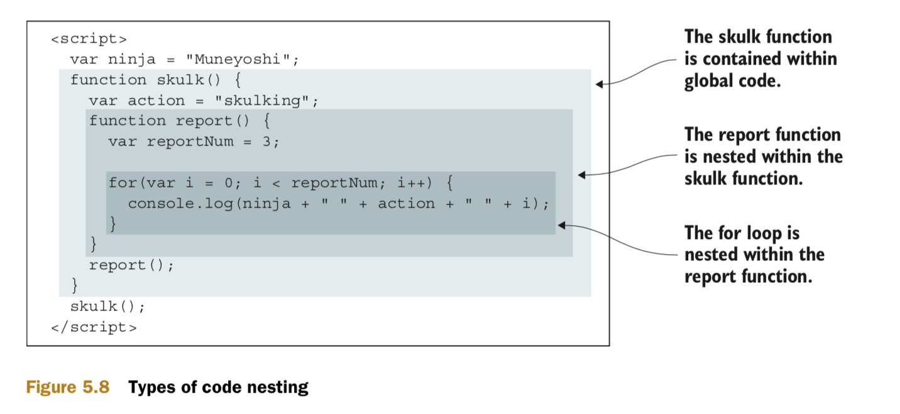
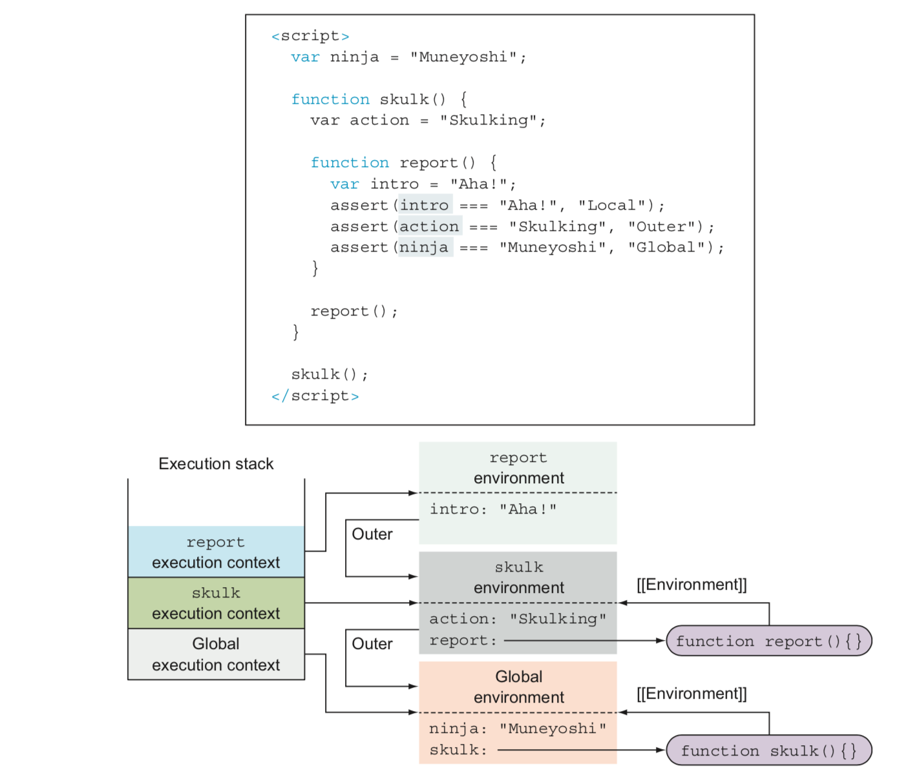
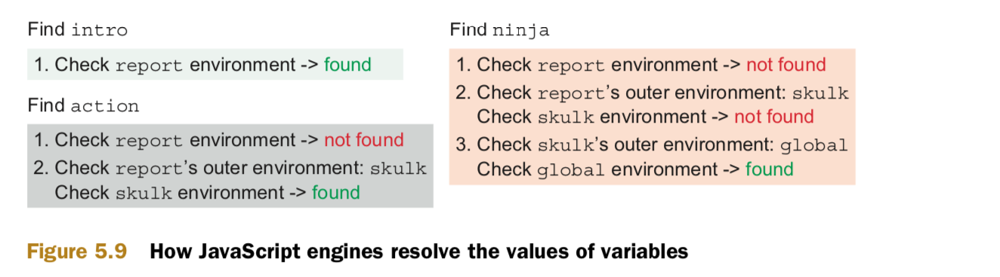
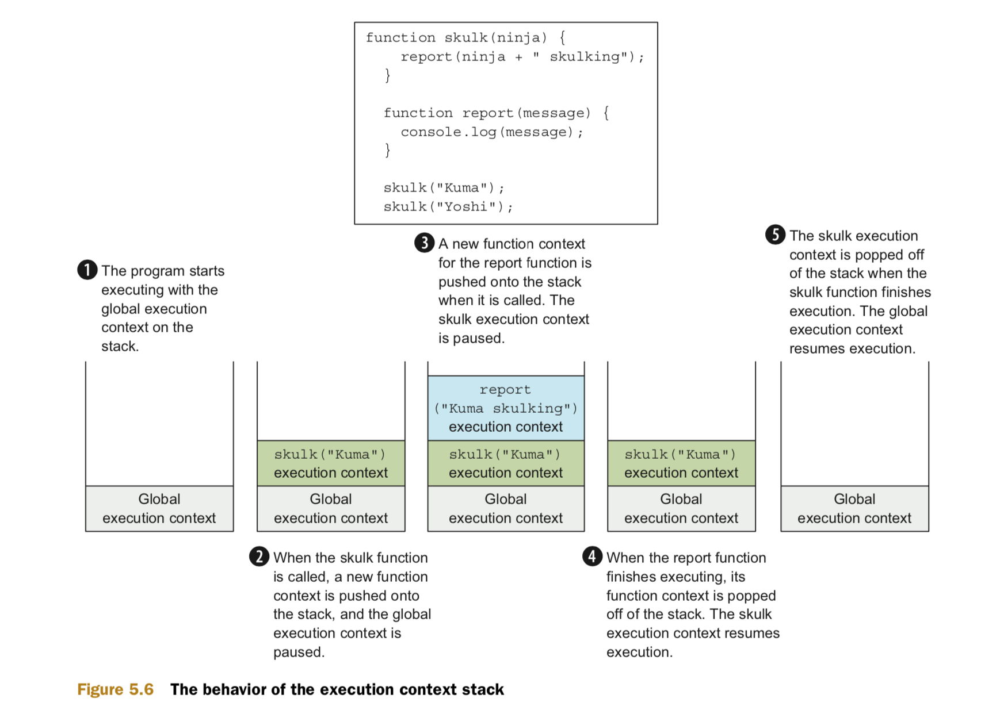
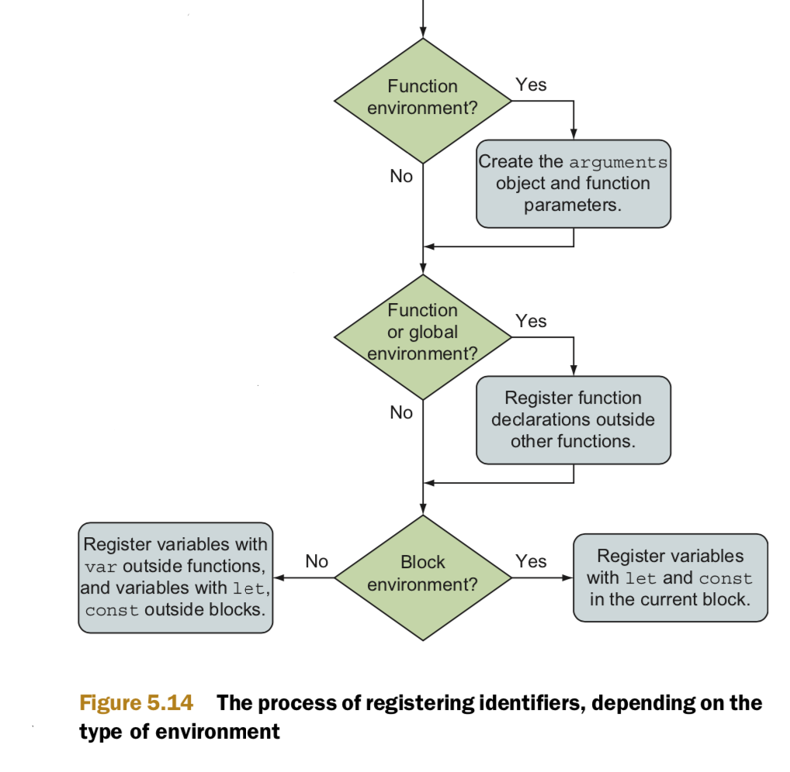

## Closure

* A closure allows a function to access and manipulate variables that are **external to that function**. 
* Closures are a side effect of how **scopes** work in JavaScript.
* Closures have been a feature of purely **functional programming languages**.
* JavaScript doesn’t have native support for **private variables**. But by using a closure, we can achieve an acceptable approximation.
* closure is created that encompasses the **function definition** as well as all variables in scope at the point of function definition.

### Mimicking private variables

```
function Ninja() {
  var feints = 0;
  this.getFeints = function(){
    return feints;
  };
  this.feint = function(){
    feints++;
  };
}

var ninja1 = new Ninja();
ninja1.feint();

assert(ninja1.feints === undefined, "And the private data is inaccessible to us.");
assert(ninja1.getFeints()=== 1, "We're able to access the internal feint count.");

var ninja2 = new Ninja();
assert(ninja2.getFeints()=== 0, "The second ninja object gets its own feints variable.");

var imposter = {};
imposter.getFeints = ninja1.getFeints;
assert(imposter.getFeints() === 1, "The imposter has access to the feints variable!");
```


### Using closures with callbacks

```
<div id="box1">First Box</div> 
<div id="box2">Second Box</div>
<script>

  function animateIt(elementId) {
    var elem = document.getElementById(elementId);
    var tick = 0;
    var timer = setInterval(function(){
      if (tick < 100) {
        elem.style.left = elem.style.top = tick + "px";
        tick++;
	  } else {
        clearInterval(timer);
        assert(tick === 100,
               "Tick accessed via a closure.");
        assert(elem,
               "Element also accessed via a closure.");
        assert(timer,
        	   "Timer reference also obtained via a closure.");
	  }
	}, 10);
}

  animateIt("box1");
  animateIt("box2");
</script>

```


## Lexical Environment
* A lexical environment is an internal JavaScript engine construct used to keep track of the mapping from identifiers to specific variables.
* Lexical environments are an internal implementation of the JavaScript scoping mechanism, and people often colloquially refer to them as scopes.
* Each execution context has a lexical environment associated with it that contains the mapping for all identifiers defined directly in that context.
* Lexical environment can be a block environment, a loop environment, a function environment, or even the global environment.



## Variables
* var defines the variable in the closest function or global lexical environment.
* let and const define variables in the closest lexical environment.




## Execution context
* There are two main types of JavaScript code: global code, placed outside all functions, and function code, contained in functions.
* Just as we have two types of code, we have two types of execution contexts: a global execution context and a function execution context.
* There’s only one global execution context, created when our JavaScript program starts executing, whereas a new function execution context is created on each function invocation.
* Whenever a function is called, a new function execution context is created and pushed onto the execution context stack. In addition, a new associated lexical environment is created. 



Execution of JavaScript code occurs in two phases:
* The first phase is activated whenever a new lexical environment is created. In this phase, the code isn’t executed, but the JavaScript engine visits and registers all declared variables and functions within the current lexical environment.
* The second phase, JavaScript execution, starts after registering has been accomplished.

<p float='left'>
	
</p>

```
assert(typeof fun === "function", "We access the function");

var fun = 3;

assert(typeof fun === "number", "Now we access the number");

function fun(){} 

assert(typeof fun === "number", "Still a number");
```

## Reference