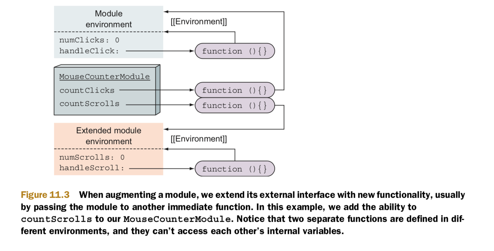

# Module

## Using objects, closures, and immediate functions to specify modules
* The numClicks variable, internal to the countClicks function.
* Our countClicks function is called only in this one place, so instead of defining a function and then calling it in a separate statement.

```
(function countClicks(){
  let numClicks = 0;

  document.addEventListener("click", () => {
    alert( ++numClicks );
  });

})();
```

```
const MouseCounterModule = function() {
  let numClicks = 0;

  const handleClick = () => {
    alert(++numClicks);
  };
  
  return {
    countClicks: () => {
      document.addEventListener("click", handleClick);
    }
  }; 

}();

assert(typeof MouseCounterModule.countClicks === "function",
       "We can access module functionality");
assert(typeof MouseCounterModule.numClicks === "undefined"
    && typeof MouseCounterModule.handleClick === "undefined" ,
       "We cannot access internal module details");
```


## Augmenting modules

```
(function(module) {
  let numScrolls = 0;

  const handleScroll = () => {
    alert(++numScrolls);
  };

  module.countScrolls = () => {
    document.addEventListener("wheel", handleScroll);
  };

})(MouseCounterModule);

assert(typeof MouseCounterModule.countClicks === "function",
       "We can access initial module functionality");
assert(typeof MouseCounterModule.countScrolls === "function",
       "We can access augmented module functionality");
```



## Modularizing JavaScript applications with AMD and CommonJS

### AMD

* AMD was designed explicitly with the browser in mind.
* AMD provides a function called **define** that accepts the following:
  * The ID of the newly created module. This ID can later be used to require the module from other parts of our system.
  * A list of module IDs on which our current module depends (the required modules).
  * A factory function that will initialize the module and that accepts the required modules as arguments.

```
define('MouseCounterModule',['jQuery'], $ => { 
  let numClicks = 0;
  
  const handleClick = () => {
    alert(++numClicks);
  };

  return {
    countClicks: () => {
      $(document).on("click", handleClick);
    }
  }; 
});
```

* AMD offers several interesting benefits, such as these:
  * Automatic resolving of dependencies, so that we don’t have to think about the order in which we include our modules.
  * Modules can by asynchronously loaded, thereby avoiding blocking.
  * Multiple modules can be defined within one file.


### CommonJS

* CommonJS is a module specification designed for a general-purpose JavaScript environment. Currently it has the biggest following in the Node.js community.
* CommonJS uses **file-based modules**, so we can specify one module per file. The file will be **synchronously** loaded.
* To each module, CommonJS exposes a variable, **module**, with a property, **exports**, which we can easily extend with additional properties.
* In the end, the content of **module.exports** is exposed as the module’s public interface.

```
const $ = require("jQuery");

let numClicks = 0;

const handleClick = () => {
  alert(++numClicks);
};

module.exports = {
  countClicks: () => {
    $(document).on("click", handleClick);
  }
};
```

To include our module within a different file, we can write this:

```
const MouseCounterModule = require("MouseCounterModule.js");
MouseCounterModule.countClicks();
```

### ES6 modules

ES6 modules are designed to marry the advantages of CommonJS and AMD:
* Similar to CommonJS, ES6 modules have a relatively simple syntax, and ES6 modules are file based (one module per file).
* Similar to AMD, ES6 modules provide support for asynchronous module loading.

To provide this functionality, ES6 introduces two new keywords:
* **export**: For making certain identifiers available from outside the module.
* **import**: For importing exported module identifiers.

```
const ninja = "Yoshi";

export const message = "Hello";

export function sayHiToNinja() {
  return message + " " + ninja;
}
```

```
const ninja = "Yoshi";
const message = "Hello";

function sayHiToNinja() {
  return message + " " + ninja;
}

export { message, sayHiToNinja };
```

```
import { message, sayHiToNinja} from "Ninja.js";

assert(message === "Hello",
      "We can access the imported variable");
assert(sayHiToNinja() === "Hello Yoshi",
      "We can say hi to Yoshi from outside the module");
assert(typeof ninja === "undefined", 
      "But we cannot access Yoshi directly");
```

```
import * as ninjaModule from "Ninja.js";

assert(ninjaModule.message === "Hello",
      "We can access the imported variable");
assert(ninjaModule.sayHiToNinja() === "Hello Yoshi",
      "We can say hi to Yoshi from outside the module");
assert(typeof ninjaModule.ninja === "undefined", 
      "But we cannot access Yoshi directly");
```

```
export default class Ninja { 
  constructor(name){
    this.name = name;
  }
}

export function compareNinjas(ninja1, ninja2){
  return ninja1.name === ninja2.name;
}
```

```
import ImportedNinja from "Ninja.js";
import {compareNinjas} from "Ninja.js";

const ninja1 = new ImportedNinja("Yoshi");
const ninja2 = new ImportedNinja("Hattori");

assert(ninja1 !== undefined
    && ninja2 !== undefined, "We can create a couple of Ninjas");

assert(!compareNinjas(ninja1, ninja2), 
    "We can compare ninjas");
```

```
import { greet as sayHello } from "Hello.js"; 
import { greet as salute } from "Salute.js";

export { sayHi as sayHello }
```

## Reference