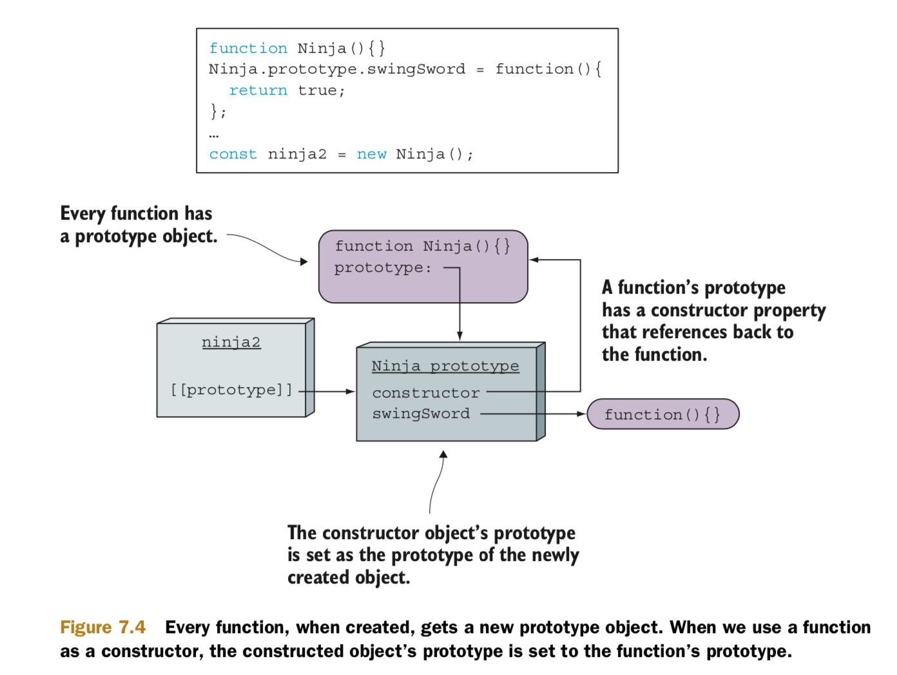

# Prototype

## Basics
```
const yoshi = { skulk: true };
const hattori = { sneak: true };
const kuma = { creep: true };

assert("skulk" in yoshi, "Yoshi can skulk");
assert(!("sneak" in yoshi), "Yoshi cannot sneak");
assert(!("creep" in yoshi), "Yoshi cannot creep");

Object.setPrototypeOf(yoshi, hattori);
assert("sneak" in yoshi, "Yoshi can now sneak");
assert(!("creep" in hattori), "Hattori cannot creep");

Object.setPrototypeOf(hattori, kuma);
assert("creep" in hattori, "Hattori can now creep");
assert("creep" in yoshi, "Yoshi can also creep");
```


## Instance vs Prototype

```
function Ninja(){}

Ninja.prototype.swingSword = function(){
  return true;
};

const ninja1 = Ninja();
assert(ninja1 === undefined,
       "No instance of Ninja created.");

const ninja2 = new Ninja(); 
assert(ninja2 &&
       ninja2.swingSword &&
       ninja2.swingSword(),
       "Instance exists and method is callable." );
```



```
function Ninja(){
 this.swung = false;
 this.swingSword = function(){
   return !this.swung;
 };
}

Ninja.prototype.swingSword = function(){
  return this.swung;
};

const ninja = new Ninja();
assert(ninja.swingSword(), "Called the instance method, not the prototype method.");
```


## With prototypes, everything can be changed at runtime

```
function Ninja(){
  this.swung = true;
}

const ninja1 = new Ninja();

Ninja.prototype.swingSword = function(){
  return this.swung;
};

assert(ninja1.swingSword(),
       "Method exists, even out of order.");

Ninja.prototype = {
 pierce: function() {
   return true;
 }
}

assert(ninja1.swingSword(),
       "Our ninja can still swing!");

const ninja2 = new Ninja();
assert(ninja2.pierce(),"Newly created ninjas can pierce");
assert(!ninja2.swingSword, "But they cannot swing!");
```


## Type of an instance
* Every function has a prototype object that’s automatically set as the prototype of the objects created with that function.

```
function Ninja(){}
const ninja = new Ninja();

assert(typeof ninja === "object",
      "The type of the instance is object.");
assert(ninja instanceof Ninja,
       "instanceof identifies the constructor." );
assert(ninja.constructor === Ninja,
       "The ninja object was created by the Ninja function.");
```

```
function Ninja(){}
const ninja = new Ninja();
const ninja2 = new ninja.constructor();

assert(ninja2 instanceof Ninja, "It's a Ninja!");
assert(ninja !== ninja2, "But not the same Ninja!");
```

## Inheritance

```
function Person(){}
Person.prototype.dance = function(){};

function Ninja(){} 
Ninja.prototype = new Person();

const ninja = new Ninja();

assert(ninja instanceof Ninja, "ninja receives functionality from the Ninja prototype");
assert(ninja instanceof Person, "... and the Person prototype");
assert(ninja instanceof Object, "... and the Object prototype");
assert(typeof ninja.dance === "function", "... and can dance!")
assert(ninja.constructor === Ninja,
      "The ninja object was created by the Ninja constructor"); // FAIL
```


```
function Person(){}
Person.prototype.dance = function(){};

function Ninja(){} 
Ninja.prototype = new Person();

Object.defineProperty(Ninja.prototype, "constructor", {
  enumerable: false,
  value: Ninja,
  writable: true
});

var ninja = new Ninja();

assert(ninja.constructor === Ninja,
      "Connection from ninja instances to Ninja constructor reestablished!");
```

## Instanceof
* instanceof checks whether the prototype of the right-side function is in the prototype chain of the object on the left. 

```
function Ninja(){}

const ninja = new Ninja();

assert(ninja instanceof Ninja, "Our ninja is a Ninja!");
Ninja.prototype = {};
assert(!(ninja instanceof Ninja), "The ninja is now not a Ninja!?");
```


## Property

 Every object property is described with a **property descriptor** through which we can configure the following keys:
* **configurable**: If set to true, the property’s descriptor can be changed and the property can be deleted. If set to false, we can do neither of these things.
* **enumerable**: If set to true, the property shows up during a for-in loop over the object’s properties.
* **value**: Specifies the value of the property. Defaults to undefined.
* **writable**: If set to true, the property value can be changed by using an assignment.
* **get**: Defines the getter function, which will be called when we access the property. Can’t be defined in conjunction with value and writable.
* **set**: Defines the setter function, which will be called whenever an assignment is made to the property. Also can’t be defined in conjunction with value and writable.

```
var ninja = {};
ninja.name = "Yoshi";
ninja.weapon = "kusarigama";

Object.defineProperty(ninja, "sneaky", {
  configurable: false,
  enumerable: false,
  value: true,
  writable: true
});

assert("sneaky" in ninja, "We can access the new property");

for(let prop in ninja){
  assert(prop !== undefined, "An enumerated property: " + prop);
}
```

## Classes
* ES6 introduces a new class keyword that provides a much more elegant way of creating objects and implementing inheritance than manually implementing it ourselves with prototypes.

```
class Ninja{ 

  constructor(name){
    this.name = name;
  }

  swingSword(){
    return true;
  }
}

var ninja = new Ninja("Yoshi");

assert(ninja instanceof Ninja, "Our ninja is a Ninja");
assert(ninja.name === "Yoshi", "named Yoshi");
assert(ninja.swingSword(), "and he can swing a sword");
```

* Classes are syntactic sugar, but under the hood we are still dealing with good old prototypes.

```

function Ninja(name) {
  this.name = name;
}

Ninja.prototype.swingSword = function() {
  return true;
};
```

### Static methods

```
class Ninja{
  constructor(name, level){
    this.name = name;
    this.level = level;
  }

  swingSword() {
    return true;
  }

  static compare(ninja1, ninja2){ 
  	return ninja1.level - ninja2.level;
  }
}

var ninja1 = new Ninja("Yoshi", 4);
var ninja2 = new Ninja("Hattori", 3);

assert(!("compare" in ninja1) && !("compare" in ninja2),
       "A ninja instance doesn't know how to compare");
assert(Ninja.compare(ninja1, ninja2) > 0,
      "The Ninja class can do the comparison!");
assert(!("swingSword" in Ninja),
      "The Ninja class cannot swing a sword");
```

### Implementing inheritance

```
class Person {
  constructor(name){
    this.name = name;
  }

  dance(){
    return true;
  }
}

class Ninja extends Person { 

  constructor(name, weapon){
    super(name);
    this.weapon = weapon;
  }

  wieldWeapon(){
    return true;
  } 
}

var person = new Person("Bob");

assert(person instanceof Person, "A person's a person");
assert(person.dance(), "A person can dance.");
assert(person.name === "Bob", "We can call it by name.");
assert(!(person instanceof Ninja), "But it's not a Ninja");
assert(!("wieldWeapon" in person), "And it cannot wield a weapon");

var ninja = new Ninja("Yoshi", "Wakizashi");

assert(ninja instanceof Ninja, "A ninja's a ninja");
assert(ninja.wieldWeapon(), "That can wield a weapon");
assert(ninja instanceof Person, "But it's also a person");
assert(ninja.name === "Yoshi" , "That has a name");
assert(ninja.dance(), "And enjoys dancing");
```

## Reference